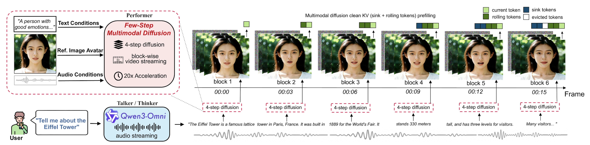
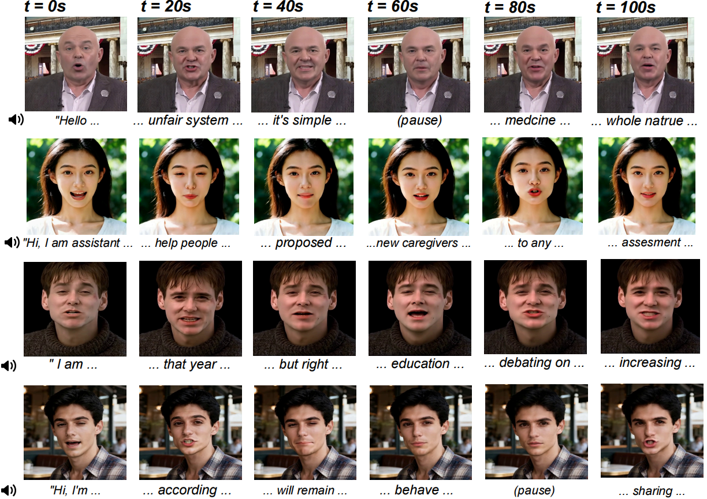

<p align="center">
<h1 align="center">LiveTalk</h1>
<h3 align="center">Real-Time Multimodal Interactive Video Diffusion via Improved On-Policy Distillation</h3>
</p>

<p align="center">
  <h3 align="center"><a href="https://github.com/GAIR-NLP/blob/main/livetalk.pdf">Paper</a> | <a href="https://github.com/GAIR-NLP/livetalk">Website</a> | <a href="https://huggingface.co/GAIR/LiveTalk-1.3B-V0.1/">Models</a></h3>
</p>

<p align="center">
  
</p>

---

**LiveTalk** enables real-time multimodal interactive avatar video generation through an improved on-policy distillation approach. By distilling bidirectional diffusion models into causal, few-step autoregressive models, LiveTalk achieves over **20× speedup**, enabling seamless real-time interactive experience.

---

## Highlights

- **Real-Time Generation**: Achieves 24.82 FPS throughput with 0.33s first-frame latency on a single GPU with compute comparable to an NVIDIA H200
- **Multimodal Conditioning**: Supports text, image, and audio inputs for flexible avatar control
- **Efficient Inference**: Reduces inference time from ~83s to real-time through 4-step diffusion distillation
- **Multi-Turn Coherence**: Demonstrates competitive performance against models like Veo3 and Sora2 on multi-round interaction benchmarks
- **End-to-End System**: Provides integration with audio language models for conversational AI applications

## Examples

<p align="center">
  
</p>

## Requirements

We tested this repo on the following setup:
* NVIDIA GPU with at least 24 GB memory (RTX 4090, A800, and H100 are tested)
* Linux operating system
* 64 GB RAM

Other hardware setups may work but haven't been tested.

## Installation
Clone the LiveTalk respository:
```bash
git clone https://github.com/GAIR-NLP/livetalk.git
cd livetalk
```
Clone the OmniAvatar repository from within the current LiveTalk repository:
```bash
git clone https://github.com/Omni-Avatar/OmniAvatar
```

Apply patches on OmniAvatar:
```bash
bash scripts/add_patch.sh
```

Create a conda environment and install dependencies:
```bash
conda create -n livetalk python=3.10 -y
conda activate livetalk
pip install -r requirements.txt
conda install -c conda-forge ffmpeg
pip install https://github.com/Dao-AILab/flash-attention/releases/download/v2.8.3/flash_attn-2.8.3+cu12torch2.8cxx11abiFALSE-cp310-cp310-linux_x86_64.whl
python setup.py develop
```

## Quick Start

### Download Checkpoints

Download the required model checkpoints:

```bash
# Download Wan2.1 base model
huggingface-cli download Wan-AI/Wan2.1-T2V-1.3B --local-dir-use-symlinks False --local-dir pretrained_checkpoints/Wan2.1-T2V-1.3B

# Download LiveTalk model checkpoint
huggingface-cli download GAIR/LiveTalk-1.3B-V0.1 --local-dir-use-symlinks False --local-dir pretrained_checkpoints/LiveTalk-1.3B-V0.1

# Download Wav2Vec2 model for audio processing
huggingface-cli download facebook/wav2vec2-base-960h --local-dir-use-symlinks False --local-dir pretrained_checkpoints/wav2vec2
```
The file structure will be:
``` text
.livetalk
|-- ...
|-- OmniAvatar
|-- pretrained_checkpoints
|   |-- LiveTalk-1.3B-V0.1
|   |-- Wan2.1-T2V-1.3B
|   |-- wav2vec2
```
### Inference
We currently offer a simple script for running video inference, but it does not support streaming input and output. The inference requires approximately 20GB of GPU memory usage. On a single H200-class GPU, our model runs at around 25 FPS, and on a single RTX 4090 it achieves around 11 FPS.

Execute the inference script with your configuration:

```bash
bash ./scripts/inference.sh
```

**Input Requirements:**
- **Image**: Reference image of the person (JPG/PNG format)
- **Audio**: Speech audio file (WAV format, 16kHz sample rate recommended)
- **Text Prompt**: Description of the desired video characteristics

**Output:**
- High-quality video  at 16 FPS
- Audio synchronized with lip movements
- Duration specified by `video_duration` parameter

## Method Overview

### Improved On-Policy Distillation Recipe

Our approach addresses challenges in distilling multimodal video diffusion models:

**Challenge**: Self Forcing encounters visual artifacts (flickering, black frames, quality degradation) with multimodal conditioning.

**Our Solution**:
1. **Curated Multimodal Conditions**: High-quality reference images (super-resolution, semantic consistency) and motion-focused text prompts
2. **Converged ODE Initialization**: Extended training (20k steps) for robust starting point
3. **Aggressive Optimization**: 2× learning rate and CFG=6 to maximize learning within limited DMD window

These improvements eliminate training instability and deliver high-quality results across perceptual metrics, audio-visual synchronization, and aesthetic quality.

### Real-Time Multimodal Avatar System

Built on the distilled few-step multimodal diffusion model, our system turns the recipe into an end-to-end, real-time talking avatar pipeline:

- **Thinker / Talker (Audio LM)**: A streaming audio language model takes user text or audio as input and produces speech responses in real time
- **Performer (Few-Step Diffusion)**: Our 4-step causal video diffusion model generates video in **block-wise AR** fashion (3 latent frames per block), conditioned on (1) streaming audio, (2) a reference avatar image, and (3) motion-focused text prompts
- **KV Cache & Streaming**: Clean KV cache from previous blocks is prefilled to maintain temporal coherence while enabling low-latency, block-by-block video streaming synchronized to the audio
- **Long-Form Identity Preservation**: We adopt **Anchor-Heavy Identity Sinks (AHIS)**, reserving part of the KV window as fixed “identity anchors” while using a smaller rolling window for context, which stabilizes appearance over minutes-long interactions
- **Parallel Denoising & Decoding**: Diffusion denoising and VAE decoding run in a pipelined manner so that generation stays ahead of playback, avoiding stalls and achieving real-time rendering

Together with the improved on-policy distillation recipe, this system delivers high-fidelity, lip-synced avatar videos with sub-second first-frame latency, supporting natural multi-turn multimodal interaction.

## Citation

If you find this codebase useful for your research, please cite our paper:

```bibtex
@article{livetalk2025,
  title={LiveTalk: Real-Time Multimodal Interactive Video Diffusion via Improved On-Policy Distillation},
  author={Chern, Ethan and Hu, Zhulin and Tang, Bohao and Su, Jiadi and Chern, Steffi and Deng, Zhijie and Liu, Pengfei},
  journal={arXiv preprint},
  year={2025}
}
```

## Acknowledgements

This codebase builds upon:
- [Self Forcing](https://github.com/self-forcing/self-forcing) for on-policy distillation framework
- [CausVid](https://github.com/tianweiy/CausVid) for autoregressive video diffusion
- [Wan2.1](https://github.com/Wan-Video/Wan2.1) and [OmniAvatar](https://github.com/omniavatar/omniavatar) for multimodal video diffusion

## License

This project is released under the Apache 2.0 license.
